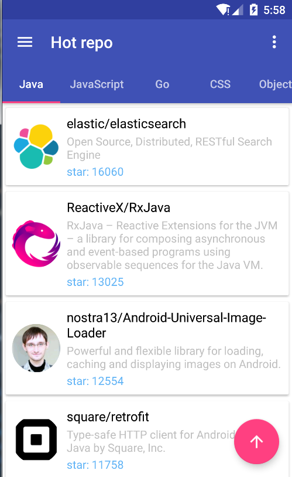

# Monkey for GitHub, Android Version
A GitHub third party client, show the rank of users and repositories,trending.
Base on Material Design,use MVP pattern
iOS version:[Monkey](https://github.com/coderyi/Monkey)

## Status

## Download
Google Play:  [Monkey](https://play.google.com/store/apps/details?id=com.yeungeek.monkeyandroid)

fir.im: http://fir.im/monkeyandroid

## API
GitHub interface: https://developer.github.com/v3/

## Function (~~Done~~)
* ~~sign in~~
* ~~user list~~
* ~~repo list~~
* ~~trending(daily,weekly,monthly)~~
* ~~user detail~~
* ~~repo detail~~
* ~~follow user~~
* ~~star repo~~

## TO DO
* search
* open url(scheme)
* showcases

## App Preview

## Open source projects
* [RxJava](https://github.com/ReactiveX/RxJava/)
* [RxAndroid](https://github.com/ReactiveX/RxAndroid/)
* [retrofit](https://github.com/square/retrofit/)
* [OkHttp](https://github.com/square/okhttp)
* [Dagger2](https://github.com/google/dagger/)
* [glide](https://github.com/bumptech/glide/)
* [ButterKnife](https://github.com/JakeWharton/butterknife/)
* [Stetho](https://github.com/facebook/stetho)
* [Sqlbrite](https://github.com/square/sqlbrite)
* [Timber](https://github.com/JakeWharton/timber/)
* [android-Ultra-Pull-To-Refresh](https://github.com/liaohuqiu/android-Ultra-Pull-To-Refresh)
* [PreLollipopTransition](https://github.com/takahirom/PreLollipopTransition)

## References
* [ribot-app-android](https://github.com/ribot/ribot-app-android)
* [Monkey](https://github.com/coderyi/Monkey)
* [GithubTrends](https://github.com/laowch/GithubTrends)